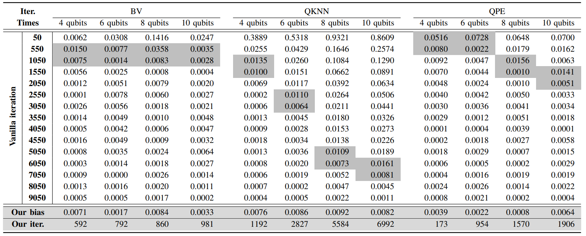

# AutoFid: Adaptive and Noise-Aware Fidelity Measurement for Quantum Programs via Circuit Graph Analysis

AutoFid is an **adaptive, noise-aware fidelity measurement framework** for quantum programs. It dynamically determines the required number of measurements (shots) to achieve accurate fidelity estimates on NISQ quantum devices, reducing redundant sampling while preserving statistical guarantees.

Unlike fixed-shot or purely learning-based methods, **AutoFid integrates circuit structure analysis, backend-aware modeling, and confidence-bound early stopping** to balance **accuracy** and **resource efficiency** in real-world quantum experiments.


## Key Features

* **Random-Walk DAG Analysis**
  Model quantum circuits as directed acyclic graphs (DAGs) and use random walk–based mixing time to quantify circuit structural complexity.

* **Adaptive Measurement Planning**
  Dynamically adjust measurement batch size and iteration count according to circuit complexity and target precision.

* **Noise-Aware Early Stopping**
  Monitor fidelity convergence with statistical confidence intervals, automatically halting when bias falls below the desired threshold.

* **Backend-Aware Correction**
  Incorporate transpilation-aware features (gate fidelity, depth inflation, crosstalk) to adjust iteration budgets for specific IBMQ backends.

* **Robust Experimental Results**
  Tested on 18 benchmark circuits across IBMQ Sherbrooke, Kyiv, and Brisbane hardware. Reduces measurement cost by >50% with fidelity bias < 0.01.


## Requirements

```bash
pip install qiskit
pip install numpy
pip install matplotlib
```


## AutoFid Workflow

<p align="center">
  
</p>
<p align="center"><b>Figure:</b> AutoFid framework for adaptive fidelity measurement.</p>

<p align="center">
  
</p>
<p align="center"><b>Algorithm:</b> Adaptive fidelity measurement pipeline.</p>


AutoFid operates in three stages:
(i) Convert the quantum circuit into a DAG and estimate structural complexity via a random walk (mixing time).
(ii) Dynamically plan measurement batches using a complexity-informed policy.
(iii) Perform iterative measurements and stop early when the confidence interval falls below the desired fidelity bias.

## Adaptive Fidelity Estimation Algorithm

<p align="center">
  
</p>
<p align="center"><b>Figure:</b> Random walk over the circuit DAG to compute mixing time.</p>

<p align="center">
  
</p>
<p align="center"><b>Algorithm:</b> Mixing time estimation via random walk.</p>


The analysis period is set as:

$$
P = t_{mix} \cdot \log(D)
$$

where $t_{mix}$ is the mixing time from the DAG, and $D$ is the transpiled circuit depth.

Fidelity results are sampled in batches of size $P$. Early stopping occurs when:

$$
z_\alpha \frac{\sigma}{\sqrt{P}} \leq \delta
$$

where $\delta$ is the target error and $\alpha$ is the confidence level.

## Evaluation

AutoFid is validated on 18 benchmark circuits including BV, QAOA, QPE, QFT, VQE, QKNN, Simon, Shor, SU2, RB, XEB, and others.

### RQ1 (Accuracy and Efficiency)

AutoFid achieves <0.01 fidelity bias with 40%-60% fewer shots than fixed-shot methods.

<p align="center">
  
</p>
<p align="center"><b>Table:</b> Comparison of the vanilla iterative processes and the proposed scheme.</p>

<p align="center">
  
</p>
<p align="center"><b>Figure:</b> The number of iterations required.</p>


### RQ2 (Pareto Trade-off)

<p align="center">
  
</p>
<p align="center"><b>Figure:</b> Pareto frontier of measurement cost vs. fidelity bias.</p>

<p align="center">
  
</p>
<p align="center"><b>Figure:</b> Required iteration for different fidelity bias constraints.</p>

### RQ3 (Testing Metrics)

AutoFid improves Effectiveness, Redundancy, Stability, Accuracy, and Latency over QuCT and fixed-shot methods.

<p align="center">
  
</p>
<p align="center"><b>Figure:</b> Radar plot comparing five classical testing metrics.</p>

### RQ4 (Ablation Study)

These results validate that both structural estimation and backend sensitivity are necessary for the observed efficiency and accuracy gains of AutoFid.

<p align="center">
  
</p>
<p align="center"><b>Figure:</b> AutoFid components ablation study.</p>

### RQ5 (Comparison with ML-based Predictors)

AutoFid consistently achieves the lowest measurement cost while maintaining equal or better fidelity accuracy, outperforming QuCT and QuEst.

<p align="center">
  
</p>
<p align="center"><b>Figure:</b> Measurement shots (bars) and fidelity RMSE (lines).</p>


## References

- [Qiskit](https://www.ibm.com/quantum/qiskit),  - IBM Quantum Computing
- [IBM Quantum](https://quantum-computing.ibm.com/),  - IBM Quantum
- [Quarl: A Learning-Based Quantum Circuit Optimizer](https://dl.acm.org/doi/abs/10.1145/3649831), 	Z Li, J Peng, Y Mei, S Lin, Y Wu, O Padon, Z Jia - OOPSLA 2024
- [t|ket⟩: a retargetable compiler for NISQ devices](https://dl.acm.org/doi/abs/10.1145/3397166.3409141), 	Sivarajah S, Dilkes S, et al. - Quantum Science and Technology 2020
- [QbC Quantum Correctness by Construction](https://ieeexplore.ieee.org/abstract/document/10458678/), 	A Peduri, I Schaefer, M Walter - OOPSLA 2025
- [Quct: A framework for analyzing quantum circuit by extracting contextual and topological features](https://dl.acm.org/doi/abs/10.1145/3613424.3614274), 	S Tan, C Lang, L Xiang, S Wang et al. - MICRO 2023	
- [Quest: Graph transformer for quantum circuit reliability estimation](https://arxiv.org/abs/2210.16724), 	H Wang, P Liu, J Cheng, Z Liang, J Gu, Z Li - arXiv 2024
